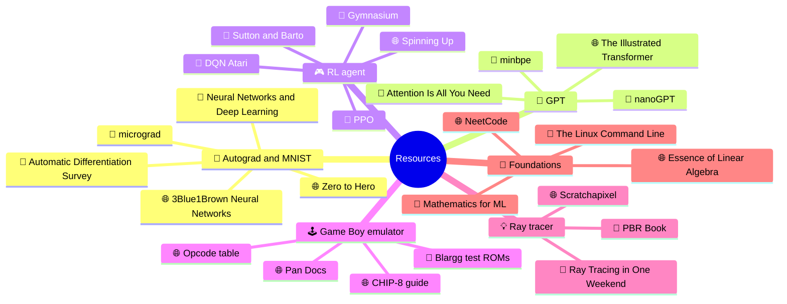

<p align="center">
  
</p>

<p align="center">
  
</p>

<p align="center">
  
  
  
</p>

---

## 🎨 pokefetch

<table>
  <tr>
    <td align="center" valign="middle">
      
    </td>
    <td valign="middle">

```text
tahary@fsr-rabat
-----------------
Pokemon  : Smeargle #235
Category : Painter Pokemon
Type     : Normal
Ability  : Own Tempo
Move     : Sketch
OS       : Linux
Uni      : FSR Rabat, Math-Info
Focus    : AI/ML + low-level systems
Langs    : Python, Bash, AutoHotkey
```

    </td>
  </tr>
</table>

<p>🟥 🟧 🟨 🟩 🟦 🟪 &nbsp;<sub>Smeargle paints with its tail. I code with mine.</sub></p>

## ⚡ About

- Studying Mathématiques-Informatique at the Faculté des Sciences de Rabat.
- Linux daily driver, comfortable in the terminal.
- Practicing data structures and algorithms.
- Interested in low-level systems and ML internals: how the thing works, not just which library to call.
- Retro gaming homebrew on the side: RetroArch setups, N64 recompilation research, PS Vita and 3DS software.

## 🛠️ Stack

<p>
  
  
  
  
  
  
</p>

## 📦 Projects

| Project | What it is |
| --- | --- |
| [Open-source-book-downloader](https://github.com/tahaenasraoui-debug/Open-source-book-downloader) | Desktop GUI (Python, Tkinter) that searches Project Gutenberg, Open Library and Google Books and downloads free, public-domain books. Borrow-only and DRM-restricted items are detected and skipped, and shadow libraries are not supported. Prefers EPUB, then PDF, TXT and MOBI, and ships as a Windows `.exe` built with PyInstaller. MIT licensed. |
| [NatroMacro (fork)](https://github.com/tahaenasraoui-debug/NatroMacro) | Fork of the Bee Swarm Simulator macro, with tuned gather paths on the `wf-pinetree-tuning` branch. |

## 🚀 Working toward

<table>
  <tr>
    <td width="50%" valign="top">
      <h3>🧬 Deep learning framework from scratch</h3>
      A small autograd engine with hand-written backpropagation, then a NumPy-only neural network trained on MNIST. No PyTorch in the core, with a benchmark against the same model written in PyTorch.
      <br><br>
      
      
    </td>
    <td width="50%" valign="top">
      <h3>🤖 GPT from scratch</h3>
      A byte-pair-encoding tokenizer and a small decoder-only transformer, trained on a text corpus I collect myself. Covers attention, positional encoding, and the training loop, all written by hand.
      <br><br>
      
      
    </td>
  </tr>
  <tr>
    <td width="50%" valign="top">
      <h3>🎮 RL agent that plays retro games</h3>
      A DQN or PPO agent trained to beat a classic game through an emulator, with training curves and replays of the agent improving over time.
      <br><br>
      
      
    </td>
    <td width="50%" valign="top">
      <h3>🕹️ Game Boy emulator</h3>
      Starting with CHIP-8 to learn the fetch-decode-execute loop, then a Game Boy emulator in C or Rust that boots and runs real ROMs. Low-level systems work, which I'm drawn to through retro gaming.
      <br><br>
      
      
    </td>
  </tr>
  <tr>
    <td colspan="2" valign="top">
      <h3>💡 Ray tracer from scratch</h3>
      A path tracer that renders scenes with spheres, reflections, refraction, soft shadows and depth of field, written from first principles with vector math and no graphics library. The output is an image gallery that shows each feature as it gets added.
      <br><br>
      
      
    </td>
  </tr>
</table>

## 🗺️ Resource map

Legend: 📘 book &nbsp;|&nbsp; 🌐 website &nbsp;|&nbsp; 🔧 tool &nbsp;|&nbsp; 📄 paper



<details>
<summary><b>🧬 Autograd and MNIST</b></summary>

| Type | Resource |
| --- | --- |
|  | [Neural Networks and Deep Learning](http://neuralnetworksanddeeplearning.com/) |
|  | [Neural Networks: Zero to Hero](https://karpathy.ai/zero-to-hero.html) |
|  | [3Blue1Brown: Neural Networks](https://www.3blue1brown.com/topics/neural-networks) |
|  | [micrograd](https://github.com/karpathy/micrograd) |
|  | [Automatic differentiation in machine learning: a survey](https://arxiv.org/abs/1502.05767) |

</details>

<details>
<summary><b>🤖 GPT from scratch</b></summary>

| Type | Resource |
| --- | --- |
|  | [Attention Is All You Need](https://arxiv.org/abs/1706.03762) |
|  | [The Illustrated Transformer](https://jalammar.github.io/illustrated-transformer/) |
|  | [nanoGPT](https://github.com/karpathy/nanoGPT) |
|  | [minbpe](https://github.com/karpathy/minbpe) |

</details>

<details>
<summary><b>🎮 RL agent for retro games</b></summary>

| Type | Resource |
| --- | --- |
|  | [Reinforcement Learning: An Introduction (Sutton and Barto)](http://incompleteideas.net/book/the-book-2nd.html) |
|  | [Spinning Up in Deep RL](https://spinningup.openai.com/) |
|  | [Gymnasium](https://gymnasium.farama.org/) |
|  | [Playing Atari with Deep Reinforcement Learning](https://arxiv.org/abs/1312.5602) |
|  | [Proximal Policy Optimization](https://arxiv.org/abs/1707.06347) |

</details>

<details>
<summary><b>🕹️ Game Boy emulator</b></summary>

| Type | Resource |
| --- | --- |
|  | [Pan Docs](https://gbdev.io/pandocs/) |
|  | [Guide to making a CHIP-8 emulator](https://tobiasvl.github.io/blog/write-a-chip-8-emulator/) |
|  | [Game Boy opcode table](https://gbdev.io/gb-opcodes/optables/) |
|  | [Game Boy test ROMs (Blargg and others)](https://github.com/retrio/gb-test-roms) |

</details>

<details>
<summary><b>💡 Ray tracer</b></summary>

| Type | Resource |
| --- | --- |
|  | [Ray Tracing in One Weekend](https://raytracing.github.io/) |
|  | [Physically Based Rendering](https://pbr-book.org/) |
|  | [Scratchapixel](https://www.scratchapixel.com/) |

</details>

<details>
<summary><b>📐 Foundations</b></summary>

| Type | Resource |
| --- | --- |
|  | [Mathematics for Machine Learning](https://mml-book.github.io/) |
|  | [The Linux Command Line](https://linuxcommand.org/tlcl.php) |
|  | [3Blue1Brown: Essence of Linear Algebra](https://www.3blue1brown.com/topics/linear-algebra) |
|  | [NeetCode](https://neetcode.io/) |

</details>

## 📊 GitHub stats

<p align="center">
  
  
</p>

<p align="center">
  
</p>

<p align="center">
  
</p>

## 📬 Contact

<p>
  <a href="https://github.com/tahaenasraoui-debug"></a>
  <a href="mailto:tahaenasraoui@gmail.com"></a>
</p>

<p align="center">
  
</p>
